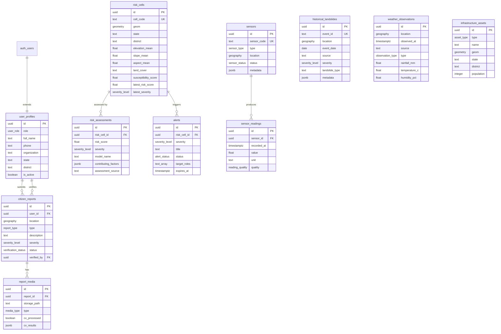

# Database Schema Documentation

## Overview

The AI Landslide Early Warning Platform uses **Supabase PostgreSQL** with **PostGIS** for spatial data support. All spatial data uses **SRID 4326 (WGS 84)**.

## Entity-Relationship Diagram



## Tables

### 1. `user_profiles`

Extends Supabase Auth's `auth.users` table with application-specific profile data.

- **PK**: `id` (UUID, references `auth.users`)
- **Role-based access**: citizen, field_officer, admin
- **Does NOT duplicate authentication** — only stores display name, phone, organization, location

### 2. `risk_cells`

Geographic grid cells for landslide risk assessment. Resolution-agnostic — the polygon geometry defines the cell area.

- **Spatial column**: `geom` — `geometry(Polygon, 4326)` with GiST index
- **Static features**: elevation, slope, aspect, land cover, susceptibility score
- **Denormalized risk**: `latest_risk_score` and `latest_severity` for fast dashboard queries
- **Design decision**: Using `geometry` (not `geography`) for polygons because polygon containment/intersection queries are faster with `geometry`

### 3. `historical_landslides`

Landslide inventory from ISRO/NRSC, GSI, and other verified sources.

- **Spatial column**: `location` — `geography(Point, 4326)` with GiST index
- **Design decision**: Using `geography` for points enables accurate spheroidal distance queries
- **Flexible metadata**: JSONB field for source-specific additional data
- **Deduplication**: `event_id` UNIQUE constraint prevents duplicate imports

### 4. `weather_observations`

Rainfall and weather data from IMD, NASA GPM/IMERG.

- **Supports both observed and forecast data** via `observation_type` enum
- **Composite index**: `(source, observed_at DESC)` for time-series queries
- **No `updated_at`**: Weather observations are append-only (immutable records)

### 5. `sensors`

IoT sensor deployment registry (soil moisture, tilt/IMU, rain gauge).

- **Spatial column**: `location` — `geography(Point, 4326)` with GiST index
- **Status tracking**: active, inactive, maintenance

### 6. `sensor_readings`

Time-series sensor measurements. Potentially high-volume.

- **Optimized index**: `(sensor_id, recorded_at DESC)` for "latest reading from sensor X"
- **Quality tracking**: good, degraded, error
- **No `updated_at`**: Sensor readings are append-only (immutable records)

### 7. `risk_assessments`

Generated risk assessment records with SHAP explainability data.

- **SHAP storage**: `contributing_factors` JSONB stores feature importances (e.g., `{"rainfall_24h": 0.35, "slope": 0.25}`)
- **Model versioning**: `model_name` + `model_version` track which model produced the assessment
- **Partial index**: Only indexes `high`, `very_high`, `critical` severity for fast alerting queries

### 8. `citizen_reports`

Geo-tagged citizen and field officer hazard reports.

- **Spatial column**: `location` — `geography(Point, 4326)` with GiST index
- **Verification workflow**: pending → verified/rejected by field officers/admins
- **Media stored separately**: Files in Supabase Storage, metadata in `report_media`

### 9. `report_media`

Media file references for citizen reports. Actual files stored in **Supabase Storage**.

- **CV integration**: `cv_processed` flag and `cv_results` JSONB for future Roboflow results
- **Partial index**: Unprocessed media (`cv_processed = FALSE`) for CV processing queue

### 10. `alerts`

Alert records for the early warning system. Notification delivery not yet implemented.

- **Role-based targeting**: `target_roles` TEXT[] array specifies who should see the alert
- **Lifecycle**: active → acknowledged → resolved/expired

### 11. `infrastructure_assets`

Villages, roads, bridges, schools, hospitals for spatial impact analysis.

- **Generic geometry**: `geometry(Geometry, 4326)` supports points (villages), lines (roads), and polygons (areas)
- **Impact analysis**: Enables "find affected infrastructure near high-risk cells" queries

## Spatial Design

| Column Use Case | PostGIS Type | Reason |
|----------------|-------------|--------|
| Point locations | `geography(Point, 4326)` | Accurate spheroidal distance (meters, not degrees) |
| Risk cell polygons | `geometry(Polygon, 4326)` | Faster polygon intersection/containment |
| Infrastructure | `geometry(Geometry, 4326)` | Generic: points, lines, polygons |

### Spatial Indexes

GiST indexes are created on:
- `risk_cells.geom`
- `historical_landslides.location`
- `weather_observations.location`
- `sensors.location`
- `citizen_reports.location`
- `infrastructure_assets.geom`

### Example Spatial Queries

```sql
-- Find sensors within 5 km of a point
SELECT * FROM sensors
WHERE ST_DWithin(location, ST_Point(93.95, 25.68)::geography, 5000);

-- Find risk cells intersecting a region
SELECT * FROM risk_cells
WHERE ST_Intersects(geom, ST_MakeEnvelope(93.0, 25.0, 94.0, 26.0, 4326));

-- Find infrastructure near a high-risk cell
SELECT ia.* FROM infrastructure_assets ia
JOIN risk_cells rc ON ST_DWithin(ia.geom::geography, rc.geom::geography, 2000)
WHERE rc.latest_severity IN ('very_high', 'critical');
```

## Row Level Security (RLS)

All tables have RLS enabled. The FastAPI backend uses the **service role key** which bypasses RLS.

| Table | Policy | Description |
|-------|--------|-------------|
| `user_profiles` | `select_own` | Users can read their own profile |
| `user_profiles` | `select_admin` | Admins can read all profiles |
| `user_profiles` | `update_own` | Users can update their own profile |
| `citizen_reports` | `select_own` | Citizens see their own reports |
| `citizen_reports` | `select_officers` | Field officers and admins see all reports |
| `citizen_reports` | `insert_own` | Citizens can submit their own reports |
| `citizen_reports` | `update_officers` | Field officers and admins can verify reports |
| `report_media` | `select_own` | Citizens see media for their own reports |
| `report_media` | `select_officers` | Field officers and admins see all media |
| Public data tables | `select_authenticated` | All authenticated users can read risk cells, weather, sensors, alerts, etc. |
| Write operations | Service role only | Sensor readings, weather data, risk assessments, alerts, infrastructure — writable only via backend service role |

## Migration Instructions

See [`backend/migrations/README.md`](../backend/migrations/README.md) for detailed instructions on applying and creating migrations.
